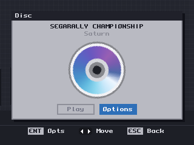
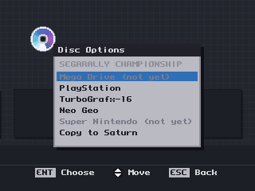
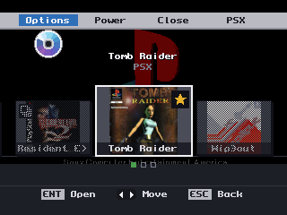
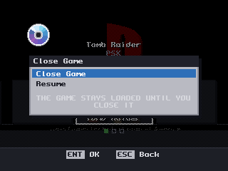
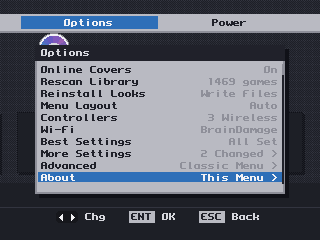

# Classic Home v5

The first full release since v4, and a large one: physical CDs, disc copying, PlayStation
controllers over SNAC in every core including PSX itself, and a great deal of work on the
parts you only notice when they are wrong.

If you are on v4, this is the one to take.

## Installing

`ClassicHome-v5.zip` unpacks to a folder called `SD-CARD-ROOT` whose contents mirror your
card. Copy that folder's *contents* onto the card root and let it merge:

```
SD-CARD-ROOT/
  MiSTer                            replaces the firmware in the card root
  menu.rbf                          replaces the menu core
  classicui/disctitles.txt          the disc name table - a new file, replaces nothing
  linux/classic-home/               the update_all boot hook's worker
  Scripts/classic_home_protect.sh   installs the hook
  Scripts/classic_home_unprotect.sh removes it again
  _Console/ _Computer/ _Arcade/     cores rebuilt with PSX-controller-over-SNAC support
```

**Back up `MiSTer` first** — copy it beside itself as `MiSTer.backup`. That is your way back.

Then, in `MiSTer.ini`, under `[MiSTer]`:

```
classicui=1
```

**The section matters as much as the line.** `MiSTer.ini` is divided into sections, and on a
card that has been in use a while the file usually *ends* inside a core or video section — so
adding `classicui=1` at the bottom scopes it to that one core and it looks like the release
simply does not work. Put it under `[MiSTer]`. If you get this wrong the front-end now tells
you: see **The configuration report** below.

## Physical CDs

Put a disc in a USB drive and it appears at the top of the shelf, named from its serial, with
its artwork. PlayStation, Mega CD, PC Engine CD and Neo Geo CD play straight from the disc.



## Copying a disc to the card

The disc screen's **Options** offers to copy the disc into the right games folder, in the
layout the core expects, with the percentage and a disc that un-dims as it goes.



**Saturn can be copied even though it cannot be played from the drive.** Those are different
questions and the front-end used to conflate them.

**Multi-disc games work properly.** Copying disc 2 of a game whose disc 1 is already on the card
*adds* it beside the first rather than offering to replace it, named with its region and serial,
and the shelf shows one card carrying every disc of that game.

## PlayStation controllers over SNAC — including on PSX

Every core in this archive reads a real PlayStation pad plugged into a SNAC adapter. That has
been true since wave 1 for most cores. **What is new is the PSX core itself.**

One line in `MiSTer.ini`, under `[MiSTer]`:

```
snac_pad=1
```

That is the whole setup. Your pad works in every core and in the menu, **Select+Start opens
the front-end**, and it can be remapped like any other controller.

### If you want a light gun, a wheel, or real memory cards

Those need the *core* to read the port instead of us, and the core's own options already say
so — there is no Classic Home setting for it any more, and the one there used to be
(`snac_psx`) is gone. Open the classic OSD with **F12** on the PSX core and set `Pad1` to
`SNAC-port1` (and `Pad2` to `SNAC-port2` for a second pad). We stand back as soon as you do,
without a relaunch, and take the port back if you set it away again.

What each choice costs you:

| `Pad1` | You get | You lose |
|---|---|---|
| `Dualshock` and every other non-SNAC value | Select+Start opens the menu; remappable | GunCon, NeGcon, wheels; memory cards are virtual |
| `SNAC-port1` | GunCon, NeGcon, the wheels, rumble, **real memory cards** | The pad cannot open the menu |

The same is true of every other SNAC core — the NES, Mega Drive, SNES, SMS and N64 each have
their own SNAC option, and turning any of them on hands that core the port. So a SNAC adapter
for one of those consoles works with its own core exactly as it did before, and our pad
support gets out of the way rather than fighting it.

These rows will move into Classic Home's own **Core Settings** screen, with the table above as
help text, once that screen can scroll. F12 is the way there for now.

### If something other than a PlayStation pad is on the SNAC port

Read this one if you have a SuperDock and have used its **bypass switch** to route the SNAC
bus to the extension port, or if you have a SNES/Mega Drive/N64 adapter plugged in.

We *drive* that port — clock, command and attention — to read a PlayStation pad, and on
another console's adapter those pins land somewhere else. Tell us and we will not touch it:

```
snac_device=1     ; something other than a PlayStation pad is on the SNAC port
```

With that set, neither the menu nor any core drives the port through us; the cores' own SNAC
options still work and are then the only thing that does. Leave it out (or `snac_device=0`) if
you have PlayStation pads or nothing plugged in, which is what makes the no-configuration case
work. We cannot detect this ourselves — nothing readable changes when that switch moves.

A wrong answer here is not silent damage waiting to happen: a controller that does not reply
like a PlayStation pad is now refused rather than believed, so the worst case is a port that
does nothing rather than a phantom pad holding every button down.

## Artwork from ScreenScraper

Cover art downloads on its own, and you set your ScreenScraper account up from the front-end —
*Options ▸ Online Covers* — rather than by editing a file. Your own account earns you a bigger
share of their capacity than the shared guest pool.

Discs get their real artwork too: the scanned face of the disc itself, on the disc screen.

**A game their database does not have is now remembered for a week** rather than being asked
about again on every boot. On a shelf of a thousand-plus games that difference is the whole
daily allowance, and spending it on questions already answered is how an account ends up
throttled. The front-end also stops asking speculatively as that budget runs low, while still
letting through the disc you are holding in your hand and waiting on.

## Closing a game

**Close** is on the menu bar while a game is running, next to Options and Power.



It does not act on one press — it opens a screen and asks, because closing discards anything
unsaved.



About has moved to the foot of the Options list, which is where a screen you read once belongs.



## The configuration report

Every boot writes `classicui/config-report.txt` to the card, listing every Classic Home setting,
**which section of `MiSTer.ini` it was read from**, and anything that looks wrong — a setting in a
section that does not apply, a duplicate, a typo.

It is written whether or not the front-end is switched on, and without consulting `debug=`. That
is deliberate: if `classicui=1` landed in the wrong section you see no front-end at all, and a
report that needed the front-end running could not tell you why. There is nothing to enable and
no script to run.

## Everything else

- **Browse by letter** — the shoulder buttons jump to the next and previous initial. Past the
  last letter, to the end of the list.
- **Typography** — pick a `.pf` font off the card, adjust letter spacing, and turn off the
  capitals if your font has lowercase worth seeing.
- **A faster menu** — *Settings ▸ Menu Resolution*, **Fast** by default: a quarter of the pixels,
  the same layout, sharpness the only cost. Games are untouched. On a 240p television it does
  nothing at all, by design.
- **A smoother disc** — the disc on the disc screen turns at 62 distinct angles a second and
  gives the processor back when a copy or a scan needs it.
- **One card per title** — the same game across several folders is one card wearing a stack, and
  you pick the version on the card.
- **Surviving `update_all`** — run `Scripts/classic_home_protect.sh` once and the updater can no
  longer replace the front-end with the stock firmware.

## Credit

Physical CD playback is [Anime0t4ku](https://github.com/Anime0t4ku)'s work, from
[Main_MiSTer_Physical_Disc](https://github.com/Anime0t4ku/Main_MiSTer_Physical_Disc) — the
streaming sector reader, the read-ahead worker, the drive-speed cap, the recovery when a USB
drive drops out, the disc swapping. Used here whole rather than rewritten, GPLv3 as this tree is.
None of the disc support would exist without that author.

---

## Known limitations — please do not report these

- **On S-Video and composite the menu is black and white.** Games keep their colour. The colour
  encoder in the shared FPGA framework sits only on the core's video path, not the one this menu
  goes out through, so it cannot be fixed in firmware. **RGB SCART and YPbPr are in full colour.**
- **With an HDMI display attached the front-end leaves the analog output alone**, so a CRT shows
  the game rather than the menu. Unplug HDMI to see the menu on a CRT.
- **No still picture behind the in-game menu over a disc game** — you get black. File-launched
  games are fine.
- **Everything above 240p is verified in the test harness only.** There is no HDMI display here,
  so the 720p and 1080p layouts have never been seen on a real panel. Still the most useful thing
  to report.
- Mega CD, PC Engine CD, Neo Geo CD and Saturn disc handling is **lightly tested on hardware**.

## Reporting a bug

Start with `classicui/config-report.txt` on the card — it answers most of what we would ask
first. Then include how your display is connected and whether the set is PAL or NTSC, what you
saw in your own words, and whether it also happens with `classicui=0`. If it does, it is not this
front-end.

For a log: set `debug=2` under `[MiSTer]`, reproduce the problem, and copy `/tmp/debug.txt` off
the machine — note that `/tmp` is a RAM disk inside the running MiSTer, not a folder on the card,
so it is not visible over FTP or SMB and is gone at power-off.

## If it goes wrong

Copy your `MiSTer.backup` over `MiSTer`. Or set `classicui=0` for the stock menu with this
firmware.
