# Classic Home

A game-oriented, SNES-Classic-style front-end for the MiSTer **menu core**.
Design rationale: `docs/CLASSIC_UI_PLAN.md`.

Enable with `classicui=1` in `MiSTer.ini`. Default is off.

**Running on hardware.** Brought up on a DE10-Nano against both a 15 kHz CRT over the
analog board and an HDMI display: the shelf, launching, save states, the in-game menu, core
options, controllers, Wi-Fi and the settings screens all work there, and the pause was
confirmed core by core on the television.

Faults that only a real machine could show are listed in the changelog of each release.
The pattern worth knowing, because it recurred: several came from using a shared firmware
mechanism whose behaviour differed from what its name suggested - a flag this code sets
itself, a state that is briefly true for another reason, a key consumed before the intended
reader sees it. The harness cannot see any of those.

For what it looks like and how to install it, see [GUIDE.md](GUIDE.md).

## What it does

Every picture below is a capture from a real DE10-Nano, taken over its analog output to a
CRT — so they are 320×240 and they are what the thing actually looks like, not a mockup or
a harness render. The harness renders live in [GUIDE.md](GUIDE.md); these do not.

### A shelf of your games

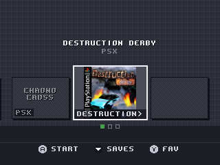
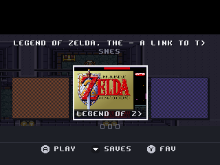

Cover art, the system, and how many times you have played each game. Left and right walk the
shelf; the shoulder buttons page it. The row begins with **Favourites** and **Systems**, and
**B** from anywhere jumps back to them rather than making you walk.

Art is found locally under `games/<System>/boxart/`, or downloaded on demand with
`classicui_artfetch=1`. The library is indexed once and cached — 1430 items on the test
machine — so later boots start instantly.

### One card per game, however many dumps of it you have

`Mega Man (U).nes` and `Mega Man (E).nes` both read as "Mega Man" once the decoration is
stripped, so the shelf used to carry two identical cards with nothing to choose between
them. Regional variants, revisions and the discs of one game all collide the same way.

They are one card now. **X** cycles the files behind it and the title block names the one
on show — `2/3  Final Fantasy VII (USA) (Disc 2).cue` — in the file's own case, since that
line exists to be read against what is on the card. X is offered only where there is
something to cycle.

What counts as the same title is the cleaned title **plus** the system and the extension,
which are there to stop a merge that would be wrong rather than to make one that would be
right: Aladdin on the SNES is not Aladdin on the Mega Drive, and the `.sms` and `.gg` of one
name are two games with different levels. The folder is deliberately *not* part of it, so a
romset filed under `USA/` and `Europe/` groups the way a player expects and a multi-disc game
stays one card wherever its discs live. Merging two genuinely different
games would hide one behind a button nobody knows to press, which is worse than the
duplicate cards this replaces. A card that still shares its title with another — those
three cases, and Recently Played, which is deliberately not grouped because its content is
a list of launches — is named by its file too, so the shelf never shows two identical
titles and no way to tell them apart.

**The card stands for the file it is showing**, not for the group: the favourite, the play
count, Recently Played, the suspend points, the per-game core options and the launch itself
all act on it. Which file a card comes up on is the one with the most plays, then a
favourite, then the first by filename — so the version you actually play is the one the card
offers, remembered in the play counts that were already per-file rather than in a new file
of its own. The exact file you were last standing on comes back with the rest of the shelf
position in `classicui_session.cfg`.

### Browsing by system

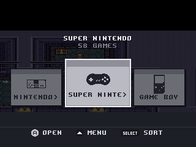

Every system has an icon, from licensed sets rather than hand-drawn — see
[ICONS.md](ICONS.md) for attribution.

### Suspend points: save states you can see

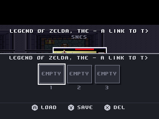
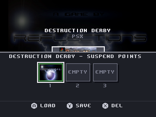

Press **down** on a game for its save states, each with a picture of the moment it holds —
captured from the frame you were looking at when you opened the menu. **A** plays from that
point, **Y** saves, **X** deletes (twice, deliberately), **down** locks a slot.

The number of slots follows what the core actually offers, and the last one is reserved to
hold the game still, so it is never shown as yours.

### The whole front-end, from inside a game

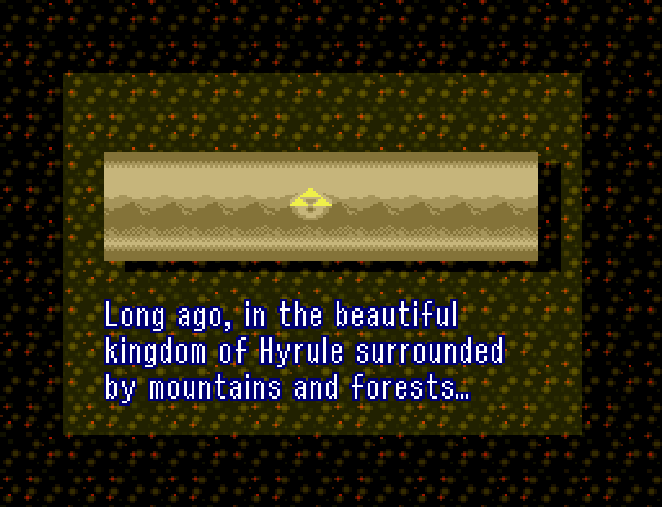

Press the menu button while playing and the entire front-end comes up over a still of your
game — shelf, suspend points, settings, everything. The classic OSD never appears on its own.

### The game is genuinely paused

On a core that can pause, it is paused — not merely covered. MiSTer has no pause command:
the signal cores pause on is derived from whether the classic OSD is open, which is exactly
what this front-end replaces. It holds that signal asserted without drawing the OSD, so
**NES, Game Boy, GBA, Mega Drive and PSX all stop** while the menu is up. Verified on
hardware, core by core.

Cores with no pause at all — SNES, Master System, TurboGrafx-16, N64, Neo Geo — are held
still with a save state instead, and `classicui_freeze=0` opts out of that.

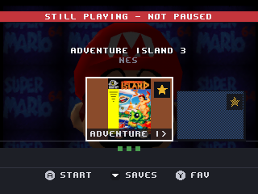

And where a core can do neither, it says so, rather than leaving you to notice.

### One card per title, whatever the ROM is called

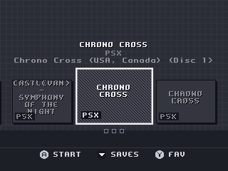

`Mega Man (U).nes` and `Mega Man (E).nes` both displayed as "Mega Man" with no way to tell
them apart. Same-titled files are now one card, **X** cycles the files behind it, and the
title block names the file on show — in the file's own case, because `MEGA MAN (E).NES` is not
a filename.

The grouping key is title + system + extension — **not** the directory. The two that remain
each prevent a merge that would be *wrong*: Aladdin on SNES is not Aladdin on Mega Drive, and
`Sonic 2.sms` is not `Sonic 2.gg`.

The directory was part of the key until 97775f0 and it is worth knowing why it left. With it,
a romset split into `USA/` and `Europe/` grouped nothing — `Batman (U).nes` and `Batman (E).nes`
sat on separate cards — and, worse, a multi-disc game whose discs live in their own folders
split up. Dropping it costs the case where a hack in its own folder shares a card with the
game it was built from, which was judged the better trade: a card that shares its title shows
the filename anyway, so nothing is hidden, whereas split discs looked like a fault.

### Recently Played

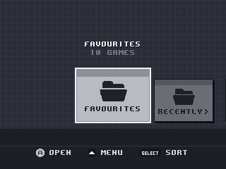
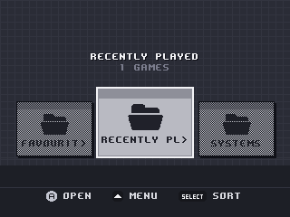

A third leading card, after Favourites. Twenty games, most recent first, one place per game
however often it is played — and absent entirely until something has been played.

Recency is stored as *order*, not a timestamp: the DE10-Nano has no battery-backed clock, so
anything played before NTP comes up would be filed under 1970 and outrank everything since.

### Starting a game at a save state

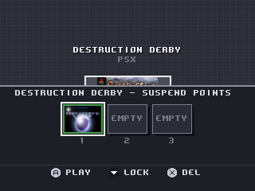

Choose a suspend point from the shelf with no core loaded and the game starts *there* rather
than from the beginning. Below, the same game fifty seconds after launch — with a state armed,
and without. The control is still on the title screen; the resumed one is past it.

| Resumed from slot 1 | Control, no state |
|---|---|
| 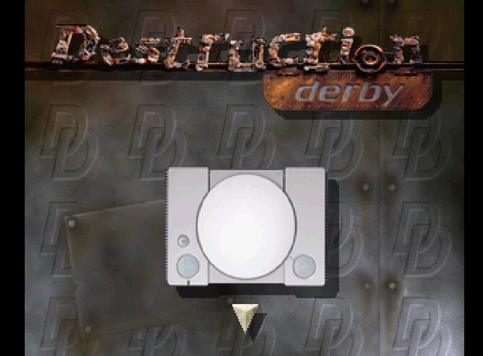 |  |

MiSTer's own "Saving the state" and "Save to state N" pop-ups are suppressed while this
front-end is up — the strip already shows the moment and whether it landed.

### The core's own settings, in our UI

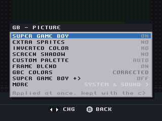
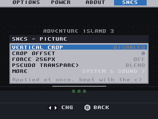

The menu bar grows an entry named after the running system — `NES`, `SNES`, `GB`, `PSX` —
which appears only while a core is loaded and only if that core published something worth
offering. It reads the core's own CONF_STR, so the list is that core's and nothing else:
Game Boy offers Super Game Boy and its palettes, SNES offers vertical crop and pseudo
transparency, N64 offers its whole VI filter chain including deblur and antialias.

Three pages. **Picture** first, because that is why anyone opens it. **System & Sound**
second. **Risky** last — and an option lands there automatically when the core marks its own
values unsafe, as PSX does with `(U) = unsafe -> can crash`.

Changes apply at once. Where they are *kept* depends on whether a game is running.

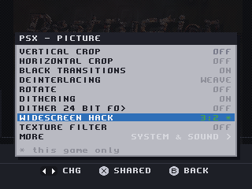

**With a game running, the change belongs to that game.** PSX's widescreen hack flatters a
3D racer and ruins the 2D game next to it on the same card, so a setting changed from inside
a game is remembered against that game and applied again the next time it starts — the core's
own `<CORE>.CFG` is left alone, and no other game on that core is affected. Such a value is
marked with a green `*`, the footer says what the star means, and X hands the setting back to
every game, putting the shared value on screen as it goes. With no game identified — a core
something else loaded — a change goes into the same `<CORE>.CFG` the classic OSD writes,
exactly as before.

**And Y is the other answer: keep the value, but for the whole system.** Sometimes a setting
tried out in one game turns out to be how the machine should behave everywhere. Y writes that
one option into `<CORE>.CFG` — *only* that one, leaving the other settings the running game
keeps to itself exactly where they are, which is the thing that used to make this impossible.
The star goes, because the value is no longer this game's, and the footer says so for a few
seconds so it cannot be mistaken for X. Both prompts appear only on a row the game actually
overrides; there is nothing to hand over anywhere else.

Per-game settings live in `config/classicui_coreopts.cfg`, keyed by system and ROM path like
the rest of the front-end's per-game state. They name the option and the value rather than
numbering them, so a core update that grows one of its own value lists cannot turn a
remembered choice into a different setting.

### Options, and the classic menu when you want it

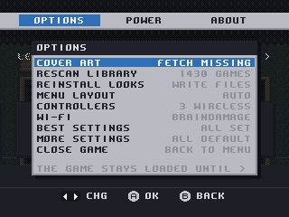
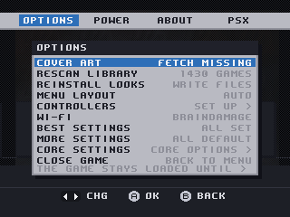

**Best Settings** turns off the pop-ups that interrupt a game and checks that the front-end
itself is enabled in a section that holds for every core, showing exactly which lines
of `MiSTer.ini` it will change and keeping a backup. **More Settings** edits the ini options
worth editing, in words a person can read, with anything away from its usual value in amber.

**Core Settings** hands the screen to the classic OSD for everything we deliberately do not
duplicate. While it is up the menu button belongs to it, so you can always get back.

### Controllers

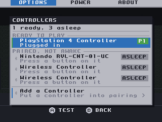
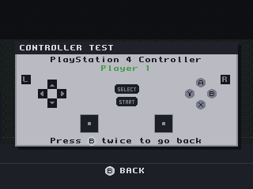

Every controller the machine can see — USB, Bluetooth and SNAC — with its player number.
Pairing is at the bottom of the list. Choose one to test it: press a button and it lights up
on a diagram drawn in that pad's own button set.

### Buttons look like the pad in your hands

| PlayStation | Nintendo |
|---|---|
|  |  |

| Xbox | Keyboard |
|---|---|
|  |  |

Four sets, thirteen glyphs, drawn at twelve pixels square. The *position* belongs to the
action, so the letter drawn is whatever is printed on your pad: the button that confirms is
the east one, which Nintendo calls **A** and Xbox calls **B**. The set is chosen from the
pad's USB vendor id first and its name second, which is what makes a DualShock 4 announcing
itself as "Wireless Controller" over Bluetooth still get PlayStation shapes.

---

## Shape

| File | Role |
|---|---|
| `chome_gfx.cpp` | Compose buffer in cached RAM, dirty-rect blit to the menu framebuffer, page flip, primitives, text in the 8x8 OSD ROM font |
| `chome_theme.cpp` | Layout profiles (hd/sd/lo) derived proportionally from the canvas, palette |
| `chome_lib.cpp` | Systems table, background scan, game index, shelf views, favourites/play counts, suspend-slot state |
| `chome_art.cpp` | Cover art: local lookup, lazy decode, LRU cache, optional online fetch |
| `chome_gamelist.cpp` | `gamelist.xml`: the art a player already scraped with any other front-end |
| `chome_video.cpp` | Video looks: preset/filter/mask/gamma generation, per-system defaults, previews |
| `chome_ini.cpp` | The `MiSTer.ini` settings this front-end assumes, and a rewrite that leaves the rest of the player's file alone |
| `chome_opt.cpp` | The `MiSTer.ini` options the player may edit: labels, defaults, ranges, and what a value is worth changing to |
| `chome_ui.cpp` | Screens, navigation, launch |
| `test/` | Host harness: compiles the modules unmodified against fakes, asserts behaviour, renders every screen to PNG. `test/protect.sh` is separate and needs no toolchain: it runs the release scripts below against a fake SD card in `/tmp` |
| `tools/` | Release tooling: `make_sdcard_root.sh` builds the SD-CARD-ROOT archive; `classic_home_protect.sh`, `classic_home_unprotect.sh` and `classic-home-restore.sh` are the boot hook that puts our firmware back after `update_all`; `disctitles.py` generates the disc name table |

Integration points outside this directory, all additive:

- `video.cpp` / `video.h`: `video_menu_fb()`, `video_menu_fb_width/height()`,
  `video_menu_fb_present()` expose the menu background double-buffer.
- `menu.cpp`: one call in `HandleUI()`, `chome_active()` in `menu_key_get()`'s
  repeat condition and in the idle-dim guard, one include.
- `cfg.cpp` / `cfg.h` / `MiSTer.ini`: the `CLASSICUI*` options.

## How it draws

The framebuffer is an uncached `/dev/mem` mapping shared with the FPGA scaler, so
per-pixel writes into it are slow. Everything composes into a malloc'd buffer and
only the damaged rows are `memcpy`'d across. Because the two framebuffers
alternate, each blit covers this frame's damage **plus** the previous frame's -
the buffer being filled is two frames stale. `gfx_end()` is where that happens.

Frames are only drawn when something changed (`mark_dirty()`); an idle menu costs
almost nothing.

## How it hides the cores

`chome_lib.cpp` holds the only mapping from a game to a core. Launching writes a
one-shot MGL to `/tmp/classicui_launch.mgl` and hands it to `xml_load()`, the same
entry point `/dev/MiSTer_cmd load_core` uses, so the launch path is the existing
tested one. Arcade `.mra` files are passed to `xml_load()` directly.

**The riskiest data in the whole feature** is the MGL `type`/`index` per core, which
comes from each core's `CONF_STR`. A wrong value hands the ROM to the wrong slot
and the game will not boot. The built-in table uses the common values but they are
not verified per core. Override without rebuilding by copying
`docs/classicui_systems.example.txt` to `classicui_systems.txt` on the SD root.

The same table records **whether each system's core has save states**
(`CH_SS_YES`/`CH_SS_NO`/`CH_SS_UNKNOWN`), which is the only way the Suspend Points
strip can say "this system cannot save your place" from the *shelf* - no core is
loaded there, so there is no `CONF_STR` to read. In the running core the `CONF_STR`
answers and the table is not consulted at all, so a rebuilt core that gains save
states is believed over a stale `CH_SS_NO`. A system nobody has measured stays
`CH_SS_UNKNOWN` and is promised nothing either way.

## The Display screen

Laid out like the SNES Classic's: a row of preview tiles with a radio under each.
Left/Right chooses, A applies. Panel height is computed from its content so the
bands cannot collide at any profile.

The original also has a **Frame** carousel here. There is no equivalent, and no
placeholder for one: MiSTer cannot composite anything over a running core, because
the HPS framebuffer *replaces* core video rather than blending with it (the `FB_*`
format bits in `video.cpp` have no alpha or overlay mode). A bezel that cannot
frame the game is not a feature, so nothing about frames or bezels exists in this
code. It would need an overlay layer in the framework scaler - FPGA work, see
`docs/CLASSIC_UI_PLAN.md` section 7.2 - and would be designed then, not now.

**The entry disappears entirely at 240p**, where the tiles would come out around
66px wide - too small to judge a filter by, and a canvas that small means an analog
CRT in practice anyway. The looks still apply from their class defaults; force
`classicui_profile=1` if you want the screen back on a small canvas.

**And it disappears entirely on analog output.** Everything in it lives in the
scaler - filters, shadow mask, gamma - so `video_scaler_is_visible()` drops the
whole menu-bar entry when the scaler's output is not what reaches the screen:
`direct_video` (raw core timing straight out the DAC) or an analog-only setup
without `vga_scaler`. HDMI presence comes from the ADV7513's HPD and monitor-sense
bits (`video_hdmi_connected()`), and when that cannot be read we assume the usual
HDMI setup. Showing a CRT-filter picker to somebody already looking at a real CRT
would be daft. The menu bar re-spaces itself over the remaining entries, and
**Menu Layout moved to Options** so it stays reachable.

## Analog video

Two reports of the same class, a month apart, and neither reproducible here:

> rolling picture on a 240p CRT via component after launching a core from the
> front-end, absent with `classicui=0`

> how i can change output resolution? i have scrambled b/w mess with rolling image on
> my crt with svideo output?, looks perfectly fine on hdmi tried changing to hd, sd, lo
> modes but it was still messed up, i've managed to get some correct ish output when
> enabled vga_scaler to 1 but colors disappeared and interface was smushed together
> with buttons overlaping etc... maybe my mister ini is causing some problems, it works
> and outputs correctly in standard mister menu or zaparoo frontend

The first was chased as a `vsync_adjust` problem and that theory was wrong, or at
least incomplete: `vsync_adjust` cannot make a picture lose its colour. The second
report is more informative than it looks, because **`classicui_profile` changing
nothing is the diagnostic**. That option only chooses a layout, so if hd, sd and 240p
all look identical, whatever is wrong is upstream of layout — in the routing or the
mode — and possibly on a wire the layout never reached.

### Where the framebuffer actually goes

Everything downstream begins with one asymmetry. The stock menu, and every core, is
drawn **into the video signal**: the `osd` module composites the OSD onto the core's
own video on both output paths. This front-end is drawn **into the HPS framebuffer**,
which the FPGA *scaler* composites — and the scaler output is what HDMI carries.

So on an analog output there are four states, and they are not equivalent:

| Configuration | Where this front-end appears |
|---|---|
| `vga_scaler=1` | On the analog port permanently, through the scaler leg. |
| `direct_video=1` | On it: `video_fb_enable()` calls `set_vga_fb(enable)` when the framebuffer goes up (`video.cpp`), in the TV mode `direct_video` already runs. |
| neither, no HDMI sink | On it, for as long as the front-end holds the screen: `video_menu_fb_analog()` → `vga_fb_takeover_update()`, in a 240p or 288p mode from `tvmodes[]`. |
| neither, HDMI attached | **Not on it at all.** `want_ui` in `vga_fb_takeover_update()` is `&& !hdmi_present()`. |

That last row is deliberate — taking the port would drag the HDMI display down to a
240p television mode with it, and HDMI beside a CRT on `vga_scaler=0` is an ordinary
setup. It is also the complete explanation for "changing to hd, sd, lo modes but it was
still messed up": on a machine with both leads in, the CRT is showing the *core*, and
no layout of ours was ever on that signal.

### Why the colour cannot come back

In the three states where the front-end *is* on the analog port, it is there through
the scaler leg — and the S-Video/composite encoder is not on that leg. From a core's
`sys/sys_top.v`:

```verilog
yc_out yc_out (.clk(clk_vid), ..., .din(vga_data_osd), .dout(yc_o));   // core path only

assign {vga_o, ...} = ~yc_en ? {vga_o_t, ...} : {yc_o, ...};           // encoder lives here
wire vgas_en = vga_fb | vga_scaler;
assign VGA_R = av_dis ? 6'bZZZZZZ : vgas_en ? vgas_o[23:18] : ... vga_o[23:18];
assign VGA_G = ...                            vgas_o[15:10] : ... vga_o[15:10];
```

`vgas_o` comes from a bare `vga_out` on the scaler clock. There is no `yc_out` in front
of it and the external-encoder subcarrier is gated off in the same file
(`~(subcarrier & csync_en & ... & ~vgas_en)`), so `vga_mode=subcarrier` is dead there
too. It is worse than a missing colour burst: `yc_out` packs chroma into R and luma
into G (`assign dout = {C, Y, 8'd0}`), so with `vgas_en` the set's chroma input is fed
a plain red channel and its luma input a plain green one. **Black and white at best.**

Two further nails, either of which would be enough on its own:

- `set_yc_mode()` is reached only from `video_mode_adjust()`, which returns early while
  `vga_fb_takeover` is held (`video.cpp`). The encoder's `PHASE_INC` is therefore never
  recomputed for the TV mode — it still holds whatever the last core needed.
- `PHASE_INC` is derived from the *core's* measured video clock, and the takeover runs
  the analog port on the scaler clock at 12.587 MHz instead.

**This is not fixable from the HPS side.** The wire is not there. It needs `yc_out`
moved onto — or duplicated on — the `vgas` leg in `sys/sys_top.v`, with a `PHASE_INC`
computed for the takeover's own mode; that is a shared-framework change, so **every
core would have to be rebuilt against it** before the colour appeared in any of them.
Recorded here rather than attempted.

### What was fixed

**The takeover no longer scandoubles an encoded output.** `tv_fb_mode()` used to add
`cfg.forced_scandoubler` to the `tvmodes[]` index unconditionally, which selects the
31 kHz member of the pair — 480p or 576p. S-Video and composite are 15 kHz standards;
there is no such thing as a 480p composite signal, so on those outputs that is not a
worse picture but no picture, which is the best single candidate for "scrambled b/w
mess with rolling image". `cfg.cpp` already draws exactly this line for
`vga_mode=subcarrier`, where it clears `forced_scandoubler` outright; it cannot do the
same for `svideo`/`cvbs` without changing what every *core* puts out, so the rule is
applied to the framebuffer's mode only. `video_fb_config()`'s width halving now asks
the same helper (`tv_fb_mode_index()`) rather than asking `forced_scandoubler` a second
time, because the two answers have stopped being the same thing.

`video_mode_load()` still scandoubles under `direct_video`, and that is left alone: it
sets the mode every core runs in, which is not this front-end's to overrule. It is
reported instead.

**The canvas shape.** A 15 kHz TV mode is 640x240 (or 640x288 with `menu_pal=1`) and
the scaler stretches the framebuffer across the whole of its active area, so those
pixels are twice as tall as they are wide. `video_fb_config()` halves the width before
handing it over — but only `if (vga_fb_takeover && fb_num && ...)`, and there is no
takeover under `vga_scaler=1` or `direct_video`, so the full 640-wide canvas arrives.

`theme_update()` was choosing the profile from the raw width, so 640 picked **SD**. SD
makes a card a quarter of the width — 160 px — which through the 228:167 ratio is 117
lines, 152 for the selected one, on a canvas 240 lines tall. Both vertical clamps
saturated and `y_pos` came out at 198 against a `y_legend` of 194: the position line
drawn *over* the button legend. That is "interface was smushed together with buttons
overlaping".

`chome_profile` now carries `px`, the number of canvas pixels in one square unit: 1
normally, 2 when the canvas is at least twice as wide as it is tall (nothing MiSTer
outputs is wider than 16:9, so that test cannot fire on a real wide canvas). The
profile and the text scales are chosen from `w / px`, and every shape that has to keep
a ratio — the card, the slot tiles, the bottom margin, which was a fraction of the
*width* being spent on lines — divides by it. At 640x240 the result is the 240p layout
exactly, twice as wide, which is what the screen shows anyway; the harness asserts that
metric by metric against the 320x240 one. The single thing it cannot fix is the 8x8 ROM
font, whose scale is one integer, so on a stretched canvas the glyphs come out half as
wide as they are tall. Thin text that fits beats correctly-shaped text drawn off the
bottom of the picture.

### What the setup screen says

`vp_analog_facts()` in `chome_video.cpp` is a pure function of `cfg` and of
`video_hdmi_connected()`, and **Options ▸ Best Settings** draws whatever it returns
under an **Analog video** heading. Report only, no write:

| Fact | Line | Fires when |
|---|---|---|
| `VP_AN_31K` | `forced_scandoubler=1: 31kHz out` | an encoded output under `direct_video` with `forced_scandoubler` — the one case the firmware fix does not cover. Drawn red; it means no picture. |
| `VP_AN_NOTUS` | `HDMI on: the CRT shows the core` | `vga_scaler=0`, `direct_video=0`, HDMI attached. |
| `VP_AN_MONO` | `Black and white on S-Video/CVBS` | `vga_mode` ≥ `svideo` and the front-end is on the analog port. |
| `VP_AN_60HZ` | `60Hz out: try menu_pal=1 for PAL` | the takeover is what shows us and `menu_pal=0`. |

Ordered worst first by bit value, at most three drawn, each line 33 characters or fewer
because that is what the panel fits at 240p — measured in the harness, not assumed.

It says nothing at all on the ordinary machine: an unset `vga_mode` with a display on
HDMI tells us nothing about a television, so the report speaks only when `vga_mode` was
chosen, or `vga_scaler`/`direct_video` is set, or no HDMI sink is attached.

**Why nothing is offered to write.** `chome_ini.cpp` keeps `vga_scaler` and
`direct_video` out of the Best Settings set, and `chome_opt.h` keeps that whole family
out of the editable options, both because a wrong value there is a black set and a card
that has to come out and go into a PC — and this audience cannot ssh in to undo it.
That judgement is not overturned here. Detecting and explaining costs nothing and can
black out nothing; writing a routing key can, and no amount of labelling makes a
television that has gone dark navigable. Where the repair is one word the line names
the word, and the player makes the edit on a machine they can still see.

`menu_pal` was the one that argued for itself and was still refused: on
`direct_video=0` it changes only the takeover's mode, so a wrong value costs the menu
and not the games. But the way it goes wrong is a rolling menu — and the control for
putting it back is inside the rolling menu. That is the no-way-back shape in miniature.

## Video looks

Eighteen presets exist, but **the list is never shown in full**: the Display screen
offers only the screens the selected game could plausibly have been played on, with
a "for &lt;hardware&gt;" heading so the short list explains itself. A Mega Drive game
is never offered an LCD; a Game Boy game is never offered a PVM.

Each look is written out as a real MiSTer preset file and applied with
`video_loadPreset(path, save=true)`, which persists per core - this drives the
existing scaler rather than reimplementing anything.

`vp_install()` **generates** everything a preset references, so the looks work on
a stock install with no community filter packs:

| Generated | What it is |
|---|---|
| `filters/ClassicHome Sharp/Soft/Blurry.txt` | 4-tap 32-phase polyphase coefficients: nearest, linear, wide tent |
| `filters/ClassicHome Scanlines*.txt` | Same, with a per-phase gain envelope. Lines summing under 128 come out darker, which is how MiSTer scanline filters work |
| `shadow_masks/ClassicHome Grille.txt` | 3x1 R/G/B aperture grille |
| `shadow_masks/ClassicHome Dot Matrix.txt` | 4x4 LCD cell grid with a black gutter |
| `gamma/ClassicHome DMG / GB Pocket / GBC / GBA AGB-001 / GBA AGS-001 / GBA AGS-101.txt` | Full 256-entry per-channel LUTs. This is what makes the handheld screens possible at all |
| `presets/ClassicHome *.ini` | One per look |

Existing files are never overwritten, so hand-tuning a generated file sticks;
delete it and use Options > Reinstall Looks to get the default back.

### What each class is offered

Most authentic first, and the first entry is also the default.

| Class | Offered | Reasoning |
|---|---|---|
| Consoles | PVM RGB, PVM S-Video, Composite TV, Sharp | A console reached a TV by RGB, S-Video or composite depending on your luck |
| Arcade | PVM RGB, PVM S-Video, Sharp | Arcade monitors were direct RGB; composite never entered the picture |
| Home computers (15 kHz: C64, Spectrum, Amiga, CPC, MSX) | PAL TV, Composite TV, PVM S-Video, Sharp | These lived on televisions, not monitors |
| VGA (31 kHz: ao486, x86, Archie) | VGA Monitor, Sharp | A VGA CRT at 480p had **no** visible scanline gaps, so no CRT looks belong here at all |
| Game Boy | Game Boy DMG, Game Boy Pocket | Both grey reflective panels: the original olive-green, then the Pocket's neutral grey with better contrast and a finer grid |
| Game Boy Color | Game Boy Color, GBA (AGB-001), GBA SP (AGS-001), GBA SP (AGS-101) | A GBC cartridge also runs on either Game Boy Advance, so all four screens apply |
| Game Boy Advance | GBA (AGB-001), GBA SP (AGS-001), GBA SP (AGS-101) | The three screen revisions and nothing else |
| Game Gear | Game Gear, Game Gear (Backlit Mod) | Backlit but murky; the LED backlight mod is common enough to deserve its own entry |
| Atari Lynx | Atari Lynx | Backlit colour with a cool cast and washed blacks |
| WonderSwan | WonderSwan | Reflective mono FSTN, warm grey, narrow range |
| WonderSwan Color | WonderSwan Color, WonderSwan | A colour Swan also plays mono titles |
| Neo Geo Pocket Color | Neo Geo Pocket Color | Reflective pastel, gentle contrast |

Shared cores are split by extension in `class_of()`: `.gbc` in the Game Boy core is
a GBC game, `.gg` in the SMS core is a Game Gear game, `.wsc` in the WonderSwan
core is a Colour game. Lynx, WonderSwan and Neo Geo Pocket are new entries in the
systems table - like every other entry, their rbf path and MGL index need verifying
on hardware.

The three GBA revisions differ in black level and contrast, which is exactly what
distinguished them in the hand (measured from the generated LUTs, black -> white):

| Revision | Range | Character |
|---|---|---|
| AGB-001 | 62 -> 184 | Unlit. Lifted blacks, crushed whites, washed out |
| AGS-001 | 45 -> 206 | Frontlit. Brighter, warmer, still washed |
| AGS-101 | 15 -> 248 | Backlit. Proper black level and full contrast |

Handhelds deliberately get no "Sharp" option: an unfiltered Game Boy is not a look
anyone is after, and the LCD is the point.

A `.gbc` cartridge in the Game Boy core resolves to the **Game Boy Color** class,
decided from the extension by `class_of()` in `chome_ui.cpp` - the panel and the
launch path both go through it so they cannot disagree. User choices are stored in
`classicui_video.cfg` keyed by system **and** class, so a DMG cart and a GBC cart
sharing one core remember different screens. A stored choice that is no longer
offered for its class is ignored rather than applied.

One limitation worth knowing: MiSTer's gamma format is three independent
per-channel LUTs, so brightness, contrast and tint are all reachable, but a true
colour-space correction matrix - the usual "GBA colour correction" approach, which
mixes channels - is not expressible.

Applying happens across the core switch: `vp_arm_for_launch()` writes the chosen
preset path to `/tmp/classicui_preset`, and `chome_core_boot()` - called from
`HandleUI()` in *every* core - applies it once the new core has booted.

### Previews

Each tile shows **a real frame of the user's own game** with the look applied over
it, so the tiles are a genuine side-by-side comparison of the same moment through
different screens. Source, in order of preference:

1. `classicui/refshots/<system>/<rom>.png` - captured by `chome_core_poll()` about
   20 seconds into a session, once per game, only when missing (SD wear). The delay
   is a heuristic: past the boot logos, into something representative.
2. an existing suspend-point thumbnail, which is also a real capture
3. failing both, a synthetic test pattern (colour bars, grey ramp, blocky sprite)

Decoding reuses `art_thumb()`'s cache, so no new decode path. `/tmp/classicui_current`
carries the system id and ROM path across the core switch so the game core knows
what it is running and where to put the shot.

**The frame is real; the filter is not.** The look is applied in software by
`vp_preview()` - LUT, horizontal bleed, scanline envelope, mask - and that is an
approximation of what the FPGA scaler does, not a readback of it. See below for why
a true readback is impossible.

The LCD cell grid uses a small fixed period in preview pixels (3, with a gentle
quarter-shade gutter) rather than one derived from the source scale. Deriving it
made the cells up to 36px across, which read as giant blocks instead of a panel -
a GBA pixel is only about one preview pixel at tile size, so a little exaggeration
is needed to be visible at all, but only a little.

**Possible future direction:** ship real captures per look, taken from hardware
once and stored as reference PNGs, instead of simulating the effect. That would be
exact where this is only indicative, at the cost of showing a fixed scene rather
than the user's own game. The two could coexist - a real capture for "what this
filter does", the user's frame for "what my game looks like".

### Why previews cannot be captured through the real scaler

The obvious idea is to let the hardware render each look and screenshot the result.
It cannot work, for three independent reasons:

1. **The capture buffer is pre-scaler.** `MISTER_SCALER_BASEADDR` is `0x20000000`,
   which `video.cpp` labels "Core's fb". `mister_scaler_read()` reads
   `width x height` at the *core's* resolution with its own stride, while
   `output_width`/`output_height` sit alongside as metadata that `do_screenshot()`
   optionally rescales *to* - pointless if the buffer were already the output.
   Filters, shadow mask and gamma are applied downstream and nothing reads back
   from there, which is also why MiSTer screenshots come out pixel-exact and
   unfiltered. Every look would capture identically.
2. **No game is loaded when the menu is open.** Classic Home runs only in the menu
   core, so there is nothing to capture at the moment the user asks.
3. **No synchronous savestate API.** Savestates exist in a subset of cores and the
   save is polled once a second (`process_ss`), so a save/switch/capture/restore
   loop cannot be driven from here.

Capturing one real frame while the game runs and applying the looks in software
sidesteps all three, works on cores without savestates, and shows every look at
once instead of one at a time.

**Scanline depth and mask strength are the most subjective numbers in the whole
feature and the first thing to tune on hardware.** A full aperture grille masks two
of three channels per pixel; stacked with scanlines it can get dark. The shipped
depth is moderate (dimming to about 73% at the darkest point).

## Best Settings

Options ▸ Best Settings writes the `MiSTer.ini` keys this front-end
assumes. Three of the four exist for the same reason: without them a classic-OSD
panel appears over the player's game, which is the one thing the front-end exists
to prevent. The fourth is the front-end itself.

| Key | Set to | Why |
|---|---|---|
| `classicui` | `1` | The front-end. `cfg.classicui` is the answer for one core on one display, while the file holds one answer per section - so `[MiSTer]` can enable it while a `[NES]` or `[video=800x600]` section turns it off again, and the player meets the classic OSD in that game or on that television from a shelf that looks entirely correct |
| `video_info` | `0` | The mode banner. Every core prints its resolution and refresh over the picture when the mode changes - so it is the first thing seen after launching a game |
| `controller_info` | `0` | The button map. `input.cpp` already suppresses this while the front-end owns the screen, but the front-end is not up in a game core, so plugging a pad mid-session still draws it |
| `disable_autofire` | `1` | A held face button plus the menu button toggles autofire and announces it in the same panel. Reachable by accident, invisible once on, and with no way back a novice would find |

**The rule that decided the set** is that a setting which changes how the machine
*behaves* outside the front-end is not ours to rewrite. That ruled out clearing
`bootcore` (changes what happens at power-on), `fb_terminal=0` (also removes
Scripts and Help from the classic menu, which Options deliberately still hands
off to), `vga_scaler` / `direct_video` (video routing; getting it wrong is a
black screen), `gamepad_defaults` (silently moves every button in every core)
and `vscale_mode`. The reasoning is in `chome_ini.cpp` beside the table so it is
not re-argued.

**And the front-end's own eleven other options are not here either**, which is the
rule worth stating in its own right: a setting whose *absence* already gives the
front-end what it wants does not belong in a set that writes lines into somebody's
file. `cfg_parse()` already defaults `classicui_freeze` to 1, `classicui_gamelist`
to 1, `classicui_overscan` to 6, `classicui_artdir` to `boxart`, `classicui_arturl`
to libretro's thumbnail server and `classicui_profile` to auto, so writing them would
add lines that change nothing and that the player then owns - and a written line
cannot tell "never set" from "set on purpose". `classicui_freeze=0` is exactly the deliberate choice of somebody whose
SNES core dies when asked for a state, and putting a 1 back over it would be this
screen breaking a game to tidy an ini. The three that are off by default -
`classicui_artfetch`, `classicui_screenscraper`, `classicui_disc` - are off because
they send ROM names to a third party, need an account we cannot create, or need a
drive whose failure mode is the console stopping. None of those is consent this
screen can give on the player's behalf. Overscan and freeze are offered on **More
Settings** instead, with their recommendation beside them.

**What this cannot repair** is the ini that never enables the front-end, or enables
it only in a section that is not being read: neither machine is running this code, so
neither can be shown this screen. That case is documented rather than coded - see the
install step in [GUIDE.md](GUIDE.md) and the note on first-run help in
`chome_ini.h`, which argues against a shelf-level prompt on the grounds that the
Options row already reads `Best Settings  3 To Change >` without being asked.

The screen lists what will change before writing anything, and takes the two
presses that everything unrecoverable here takes. The left column is an outcome
the player can judge; the right column is the exact line that will be written,
for anyone who wants to know what is being done to their file.

**The file is the player's.** Everything not being set is copied through byte for
byte - line endings, comments, ordering, unknown keys, sections we have never
heard of. `MiSTer.ini` is CRLF and hand-edited, and a rewrite that reflowed it
would lose the notes people leave themselves and turn every later diff into
noise. The old file is kept as `MiSTer.ini.bak` (deliberately not
`MiSTer_backup.ini` - `cfg_get_name()` scans the root for that pattern and would
offer the backup as a fourth ini to boot from), and a backup that cannot be
written stops the whole thing.

Assignments are set **wherever they appear**, including in a core or `[video=]`
section. Those are parsed after `[MiSTer]` and win, so fixing only the first one
would leave the pop-up on in that core. Keys that appear nowhere are appended
under a `[MiSTer]` header of their own, because the file may well end inside a
core section.

No restart is needed. The firmware re-execs on every core switch and so re-reads
the ini anyway; `ini_apply()` also pokes the `cfg` field behind each setting, so
the session already running is under the new values too. That is what the panel
says, and it is read off the table rather than asserted - a setting with no `cfg`
field would make it say the opposite.

## More Settings

Options ▸ More Settings edits `MiSTer.ini` directly - the screen next to Best
Settings, which writes a fixed set without asking. Eleven options today, across
three groups (Picture, Controllers, This Menu), in one flat list that scrolls;
the group of the row under the cursor is in the panel header, which is how the
grouping shows without spending rows on headings.

Left and right change a value, X puts it back, and nothing is written until
**Save Changes** at the bottom of the list is confirmed twice. Leaving with
unsaved edits asks before throwing them away - the alternative, saving on the way
out, is the worse surprise.

**A value that is not the recommended one is amber**, and the line under the list
names what it usually is. For most options "recommended" is simply the machine's
default; for the two this front-end has an opinion about - `disable_autofire` and
`controller_info`, both in the Best Settings set - it is what Best Settings
writes. The two tables would otherwise contradict each other on screen, so the
harness checks they agree.

### Where the metadata lives, and why not in cfg.cpp

`ini_var[]` in `cfg.cpp` already has every option's name, type and range, and
nothing else: no labels, no defaults (those are assignments at the top of
`cfg_parse()`), no grouping. So `chome_opt.cpp` carries a table of its own,
copying the range and the default by hand. That duplication is the cost of not
touching firmware-wide code for a front-end's benefit; what the harness can check,
it does.

### What is not offered

Nothing that can leave the machine with no picture and no way back:
`vga_scaler`, `direct_video`, `vga_mode`, `forced_scandoubler`, `video_mode`,
`fb_terminal`, `bootcore` and `main`. The audience for this front-end cannot ssh
in to undo a black screen. `gamepad_defaults` is out for the same reason in
miniature - it silently moves every button in every core.

Every value is picked from a list or stepped inside the range `cfg.cpp` declares,
so nothing here can write a value the parser will reject. That is not tidiness:
`ini_parse_numeric()` raises a `cfg_error()` for an out-of-range value and
`user_io.cpp` shows those as an `Info()` panel over the game for five seconds on
the next core load - a classic-OSD element, which is the thing the front-end
exists to prevent. A file that already holds an out-of-range value is shown
clamped, because that is the value the firmware will use.

The picture options (`vscale_mode`, brightness, contrast, colour,
`hdmi_limited`, `hdmi_game_mode`) **disappear when the scaler's output is not what
reaches the screen**, on the same `video_scaler_is_visible()` test that drops the
Display entry from the menu bar, and for the same reason: on `direct_video` or an
analog-only set they change nothing at all.

Only what changed is written. Writing the whole table would plant a dozen lines in
somebody's ini for things they never touched, and freeze today's defaults into a
file that would otherwise follow the firmware. The write itself is
`chome_ini.cpp`'s - same backup, same binary CRLF-preserving rewrite, same
`.bak` - so there is one ini writer here, not two.

**Widening the set is a table edit**, and the shape of the entry says what is
needed: a key, a label, a sentence, a range, a default, and a `cfg` field to poke
so this session agrees with the file. An option whose worst case is a machine the
player cannot recover would need to say so on screen before it is set, the way
closing a game does; nothing in the table today does.

## Wi-Fi and Controllers: the screens where you wait

These two are the only places in the front-end where the player asks for something and
then has to stand there. Both are built from the same three pieces, which live beside
`draw_rows()` in `chome_ui.cpp` and are deliberately general - the rest of Options
wants the same treatment and a second copy would drift.

| Piece | What it is |
|---|---|
| `draw_listrow()` | A row with an icon column, a title, a **second line** saying what the thing is, a state chip on the right and a colour stripe on the left. The stripe survives selection, so the one row the player is looking at is not the one row that stops saying what it is |
| `draw_section()` | A heading and a rule over a group of rows, for one line |
| `draw_progress()` | The mark, the headline, a **progress track** and the guidance, centred in the panel |

What each screen gained:

- **Wi-Fi** has a status band across the top - signal bars, the network, the address -
  and each row says "Connected", "Needs a password" or "Open" instead of leaving that
  to a padlock. A join is a progress screen with named steps.
- **Controllers** groups the list into *ready to play* and *paired, not awake*, with a
  player chip (`P1`) or `ASLEEP` on the right and what to do about it underneath. "Add
  a Controller" is **pinned** to the foot of the panel and the list scrolls above it,
  so it is reachable at any number of pads rather than at up to five of them.

### The animation is a state, not a decoration

`gfx_spinner()` and `gfx_track()` (`chome_gfx.cpp`) are the only animated things here
and both are driven by what a real child process reported:

- `bt_pair_step()` reads `btctl`'s own commentary - found, pairing, connecting, done -
  so the track advancing is the pairing advancing, and a pairing that stalls stops the
  track. A failure is left showing **how far it got**, because "it never saw the pad"
  and "it paired and could not connect" are different things to try next.
- `net_join_phase()` is the join child's own report. It writes one digit to
  `/tmp/chome_join.txt` after each step and the parent reads it once a frame. Putting
  the old network back is drawn as *no* progress rather than as a nearly-full bar - it
  is not step five of joining, it is the opposite of it.

`ui_busy()` decides whether anything turns, and returns 0 unless a scan, a join or a
pairing is genuinely in flight. Nothing spins because a screen is open: an indicator
that always spins teaches people to ignore it, and then it cannot do the one job it
has, which is to say "this has not hung". A busy screen repaints at `GFX_SPIN_MS`
(100 ms), not at frame rate - the ring has eight positions and a repaint is a full
compose and blit, which matters over the minute a pairing can take.

Neither indicator is an icon and neither wanted to be; see `ICONS.md`.

## The index cache

Every core switch re-execs the binary, so without a cache the first menu open
after each switch would walk the whole library again - which matters most exactly
where it is least welcome, opening the menu from inside a game.

So a completed scan writes `classicui/index.bin`: a header, the item array, and
the mtime of every directory the scan visited. `lib_init()` loads it and skips
scanning when it is still valid.

Validation is deliberately cheap. Adding or removing a file changes its parent
directory's mtime, so stat()ing the recorded directories catches library changes at
a fraction of the cost of re-reading them - one stat per directory, versus a
readdir of every entry. The cache is rejected when:

- a recorded directory is gone or its mtime moved (a game was added or removed)
- a system's folder exists now but was not walked then (a whole system appeared,
  which mtimes cannot catch on their own since the new folder has no record)
- the systems table signature changed (`classicui_systems.txt` was edited)
- the build changed: version, or `sizeof(chome_item)`, no longer match

Favourites and play counts are re-read from the state file rather than trusted from
the cache, and savestate slots are zeroed on load since they are re-read per
selection anyway.

`lib_rescan()` (Options > Rescan Library) deletes the cache and scans from scratch,
which is the escape hatch for the one case validation can miss.

## Cover art

Lookup order:

0. whatever `gamelist.xml` names for that game, when the games folder has one -
   see below
1. the scraper media folders beside the ROMs, named after the ROM file:
   `<games dir>/media/box2d/<ROM name>.png`, then `boxart`, `images`,
   `media/images`, `media/mixed`, `media/screenshot`, `screenshots`
2. our own `classicui_artdir` (default `boxart`), in three shapes:
   `<artdir>/<System Name>/Named_Boxarts/<ROM name>.png` - the libretro convention
   the community packs use - then `<artdir>/<games dir>/<ROM name>.png`, then
   `<artdir>/<games dir>/<cleaned title>.png`
3. next to the ROM

`.jpg` is tried too, but the bundled Imlib2 links only libpng, so JPEG support
depends on the shipped `libImlib2.so` loaders - PNG is the safe format.

Lazy: the UI requests art for the visible cards plus a lookahead, prioritised by
distance from the selection, and at most **one image is decoded per frame**.
Imlib2 keeps its state in a global context, so decoding on a worker thread would
race with the wallpaper code in `video.cpp`; one card per frame fills a shelf as
fast as anyone scrolls. Decoded cards are cached at the selected-card size with a
24 MB LRU, aspect-fitted onto the system's plate colour rather than stretched.

Fetching (`classicui_artfetch=1`, **off by default**) forks `curl` for one image at
a time and polls it without blocking. It writes into layer 2's first shape, so a
fetch permanently populates the local pack and the next boot needs no network. It is
opt-in because it necessarily sends ROM names to a third party.

### gamelist.xml

`gamelist.xml` is EmulationStation's metadata file and every front-end worth
interoperating with reads or writes it - stock ES, RetroPie, Batocera, Recalbox,
ES-DE - as do the scrapers people actually use, Skraper and Skyscraper. Anyone who
has scraped a card once on a PC already has one, so reading it means their art works
here with no second scrape and no renaming. `chome_gamelist.cpp`, on by default,
`classicui_gamelist=0` to ignore it.

The format facts this is built on, from
[Aloshi's GAMELISTS.md](https://github.com/Aloshi/EmulationStation/blob/master/GAMELISTS.md)
and [Batocera's copy of it](https://github.com/batocera-linux/batocera-emulationstation/blob/master/GAMELISTS.md),
with the field lists read out of
[`MetaData.cpp`](https://github.com/batocera-linux/batocera-emulationstation/blob/master/es-app/src/MetaData.cpp)
and the resolution rule out of
[`Gamelist.cpp`](https://github.com/batocera-linux/batocera-emulationstation/blob/master/es-app/src/Gamelist.cpp):

- It lives in the system's ROM folder - `games/<System>/gamelist.xml`. ES also looks
  in `~/.emulationstation/gamelists/<system>/` and `/etc/emulationstation/...`;
  neither exists on a MiSTer card, so neither is looked for.
- Root is `<gameList>`; children are `<game>` and `<folder>`. Only `<game>` is read:
  a `<folder>` names a directory and the shelf has no card for one.
- A media path is absolute, or relative to that ROM folder and conventionally
  prefixed `./`, or prefixed `~/` for the scraping machine's home directory. The
  first two resolve; `~/` does not, since MiSTer has no home worth resolving against
  and a tree copied off a PC would not be at the same place anyway.
- Text is entity-escaped (ES writes through pugixml, which escapes rather than using
  CDATA), so `&amp;` and friends and numeric references are decoded. A `<path>` with
  no `./`, or with Windows separators, is matched all the same.

Which tag becomes the cover, best first: **`<boxart>`** (Batocera's own field for the
2D box, so it says exactly what it holds), **`<thumbnail>`** (in ES's vocabulary the
box front, where `<image>` is the "main" picture), **`<image>`** (which is what a
gamelist naming only one picture uses), then `<mix>`, `<titleshot>`, `<fanart>`.
`<marquee>`, `<wheel>`, `<video>`, `<manual>`, `<magazine>`, `<map>`, `<bezel>`,
`<cartridge>` and `<boxback>` are deliberately never covers - a logo on transparency
or the back of a box on a card would look like a bug.

Only pictures are read. Names, genres and descriptions are not: titles come from
filenames, and the title *grouping* that puts three dumps of one game behind one card
is built on that, so taking names from a gamelist would quietly change which games
share a card.

**Why gamelist wins over `classicui_artdir`.** It is the one layer where the player
has said *this file belongs to this game* rather than us guessing from a name, and it
is the output of a deliberate scrape with a tool they chose; `artdir` is a convention
we invented, whose third shape matches on a cleaned title and is the loosest match
here. An entry naming a file that is not on the card does not win, though - a stale
scrape falls through to the later layers instead of producing a blank card - and
`classicui_gamelist=0` is the escape hatch if a scrape's pictures are worse than the
local pack's.

**ES-DE is the exception worth knowing.** It writes `gamelist.xml` but deliberately
puts no media paths in it, matching media to ROM names under
`downloaded_media/<system>/covers/` instead ("ES-DE does not use tags inside the
gamelist.xml files to find game media",
[USERGUIDE.md](https://gitlab.com/es-de/emulationstation-de/-/blob/master/USERGUIDE.md)).
Its gamelists are read here and simply name nothing, which is why layer 1 exists: the
same filename-matching idea, against the folders Skraper and Batocera write.

**What it costs.** Parsing is lazy and per system - the first time a card from that
system asks for art, not during the library scan, which is already the slow part of a
cold boot - and a player who never scrolls to the Mega Drive shelf never pays for its
gamelist. A generated 3000-game gamelist (2.5 MB, the shape Skraper writes: desc,
image, thumbnail, marquee, video, and the metadata fields) parses in **81 ms** on the
development host and costs 72 KB of entry table plus 135 KB of strings; later lookups
are 2.3 µs each. On a DE10-Nano expect that to be closer to half a second including
the read off the card, i.e. one stutter the first time you reach a big scraped
system - **not measured on hardware**. A few hundred games, which is the normal case,
is a tenth of that.

**What it refuses.** This is a file we did not write, of unknown size, on a card:

- Over 16 MB is not opened at all - a renamed ROM or disc image is the case that
  matters, and no real gamelist is close. The cost is that a MAME-scale gamelist is
  ignored rather than partly read.
- The XML is parsed with `sxmlc`, the parser already in this tree (`user_io.cpp`
  reads `.mra` files with it, the Neo Geo loader reads `romsets.xml`), streaming to
  the next `>` rather than loading the file - so a 15 MB gamelist costs a tag's worth
  of memory, not 15 MB. What *would* grow is one stretch with no `>` in it, which is
  what the size limit above actually guards. Writing another XML parser for a format
  we do not own would be the wrong kind of confidence.
- 4096 entries and 256 KB of strings, across all systems together. Hitting either
  stops the read and keeps what fit: a cap makes what was read short, not wrong.
- A **parse error throws the whole file away**, including entries that had already
  parsed cleanly - a half-read gamelist is not a smaller gamelist - and the shelf
  behaves exactly as though the file were not there. Malformed means no art, never a
  crash and never a stall that grows with the damage.

## Keys

Gamepad mapping follows `input.cpp`'s OSD translation, so pads work exactly as they
do in the classic menu, and the keyboard column below *is* that translation read
backwards - what the legend shows is what the key does.

| Gamepad | Keyboard | Action |
|---|---|---|
| D-pad | arrows | move / reveal menu bar (up) / suspend points (down) |
| A | Enter | start, resume, open folder, confirm |
| B | Esc | back, leave folder, resume |
| X | Tab | cycle the files behind a card, delete a suspend point (two presses), or put a setting back to its usual value |
| Y | Backspace | favourite, or save into a slot in-game |
| Select | ` (backtick) | sort |
| L / R | - / = | jump one screenful |
| OSD / menu | F12 | open the front-end over a running game, or hand to the classic menu |

**The legend relabels itself to match whichever device you last touched** - `A START`
on a pad, `ENTER START` on a keyboard - and switches back the moment you touch the
other one. The 240p profile uses shortened keyboard names (`ENT`, `BSP`) since the
legend is tight there.

There are four sets of button prompts and a fallback, chosen by `pad_layout()` in
`chome_ui.cpp` from the name of the device the last menu key came from:

| set | drawn as | recognised by |
|---|---|---|
| keyboard | key names on a light chip, no colour | nothing was pressed on a pad |
| PlayStation | the four shapes | `SNAC`, `PlayStation`, `DualShock`, `DualSense`, `Sony` |
| Nintendo | letters, Super Famicom colours | `SNES`, `Nintendo`, `Famicom`, `Joy-Con`, `Switch Pro` |
| Xbox | the same letters, Xbox colours | `Xbox`, `X-Box`, `XInput` |
| unknown | the same letters, one grey | anything else |

A name that states only a *brand* is not enough to pick a layout - 8BitDo alone sells
pads lettered both ways - so those land on the fallback deliberately. The fallback
still names the right button; it just does not invent a colour scheme for a pad it
cannot identify.

**Which letter or shape goes on a prompt comes from the button code the pad reports**,
via `input_menu_key_btn()`, so remapping the pad moves the prompt with it. That code
is read as a *position* on the pad and then through that layout's own diamond, because
Xbox swaps A/B and X/Y round from Nintendo: the east button is `A` on a Super Famicom
and `B` on an Xbox, and with MiSTer's default map (`def_mmap`, which binds `SYS_BTN_A`
to `BTN_EAST`) east is what confirms. Reading the code's *legacy* letter name instead -
`BTN_EAST` is also `BTN_B` - describes every pad in the world as though it were an
Xbox. See the comment above `code_letter()` for why the two diamonds nevertheless agree
about X and Y.

That needs a signal from outside: a gamepad's buttons reach the menu as *synthetic
key events carrying the same codes a keyboard sends*, because `joy_digital()` builds
an `input_event` and pushes it through `input_cb()` with `menu_event` set. The codes
are therefore identical and cannot be told apart. `input_cb()` already knew the
difference, so `input.cpp` now records it at the single point where a key is handed
on (`user_io_kbd()`), and exposes it as `input_menu_key_from_pad()`.

Key repeat for the shelf needs `chome_active()` in `menu_key_get()` - without it
`menu_key_get()` only repeats for ASCII keys and the file browser.

## Running it on a laptop

```
support/classicui/test/play.sh              # 1280x720
support/classicui/test/play.sh --sd         # 640x480
support/classicui/test/play.sh --lo         # 320x240
support/classicui/test/play.sh --no-fetch   # stay offline
```

Then open <http://localhost:8099> (`PORT=9000 play.sh` if that clashes). Arrow keys move, Enter is A, Esc is B, Tab is X,
Backspace is Y, backtick is Select, `-`/`=` are L/R, and **M is the OSD/menu
button**.

It runs the real front-end against a fake SD card built from
`test/placeholder_games.txt`: **528 placeholder games** across 19 system and
extension groups, in **No-Intro / Redump naming**. That naming is the point - it is
what the libretro thumbnail server keys covers on, so cover fetching is exercised
for real rather than simulated. A spot check of 18 random entries resolved 15
against the live server; the rest are name variants that fall back to the generated
card, which is useful too since it puts all three states on screen at once.

Only two covers are planted locally, so you can watch the rest arrive lazily as
cards come into view. Fetching is **on** here (unlike the product default) because
testing it is the point; `--no-fetch` turns it off, and the container gets `curl`
because that is what the fetcher forks.

Nothing is installed on the host: the container already has imlib2, and
`linux/input.h` is the only Linux-specific header the project pulls in, so building
natively would need a shim that this avoids.

**Launching is simulated rather than refused.** Pressing A on a game flips the
viewer into "game core" mode with a synthetic game picture derived from that game's
name, so pressing M then exercises the in-game menu, its live save states, Video
Look over the running frame, and Close Game - the whole loop, without a MiSTer.

How it works: the viewer runs the UI and serves the compose buffer over HTTP; the
page draws it into a canvas and posts keys back. Frames are sent only when the
generation counter moves, so an idle menu costs nothing.

What it cannot tell you, and this is the important part: redraw cost on uncached
memory, SPI behaviour, whether a core accepts an MGL, or what the video looks
actually do - those are the FPGA scaler's, and here they are only the software
approximation `vp_preview()` draws.

## Testing without hardware

`support/classicui/test/run.sh` builds a host binary in Docker from the real
`chome_*.cpp` files plus fakes for the framebuffer, SD card, clock, `xml_load()`
and `video_loadPreset()`. It creates a fake SD card, walks every screen at four
canvas sizes, writes a PNG of each to `test/out/`, and runs 635 assertions over the
index, sorting, views, title groups, savestate slots, art decode, the generated
video files and the exact MGL emitted at launch.

It found real bugs that compile cleanly: a tap-run being mistaken for a held key,
an enter-then-immediately-leave on the first menu press, and cards 30% too small at
240p. What it cannot tell you: redraw cost on uncached memory, SPI behaviour, or
whether a core accepts the MGL.

## Deliberately not implemented

- **Gameplay frames/bezels, in-game graphical overlay, UI sound, rewind.** All
  four need FPGA-side work or per-core emulation features that do not exist. A
  menu-only "frame" was built and then removed: decorating the menu with a bezel
  while the game itself cannot have one is a feature in name only.
- ~~Suspend-point thumbnails.~~ **Done.** `process_ss()` in the main binary is
  what notices a savestate (it polls a counter in shared memory and writes the
  `.ss` itself), so no core change was needed: it now also calls
  `screenshot_thumbnail()` from `scaler.cpp` to write
  `savestates/<core>/<rom>_<n>.png`, which the strip displays and falls back to
  the cover when absent. The poll can be up to a second behind the actual save,
  so the frame is close but not exact.
- **Playing a physical CD.** Working, and hardware-verified for PlayStation on 2026-08-05:
  Metal Gear Solid booted and ran from a disc in a USB drive, launched from the shelf. Off by
  default behind `classicui_disc`.

  Detection and identification are ours (`chome_disc.{cpp,h}`): a helper *process* owns
  `/dev/sr0` and publishes a one-line state file, because every ioctl on that device serialises
  behind whatever the drive is doing and doing it inline froze the console three times. The
  streaming reader under it (`support/physical_disc/`) is taken **whole** from
  [Anime0t4ku/Main_MiSTer_Physical_Disc](https://github.com/Anime0t4ku/Main_MiSTer_Physical_Disc)
  (GPLv3, as are we) rather than paraphrased - the one time that lifecycle was rewritten
  smaller it cost two frozen consoles. **Playing a real CD on a MiSTer at all is
  Anime0t4ku's work**; keep the credit wherever this feature is described to users. See
  `../physical_disc/CREDITS.md` for which part is whose.

  Four cores are wired: PC Engine CD, PlayStation, Mega CD, Neo Geo CD. Only PlayStation is
  hardware-tested. Upstream reports Mega CD and PC Engine CD at full speed and PSX "nearly
  fluid" with FMV and CD-audio problems, so expect the PSX experience to be imperfect.

  Two things worth knowing before extending it. A Mega CD disc launches the **separate MegaCD
  core**, not the shelf's Genesis core - `Genesis.sv` has no disc mount entry at all - so
  `disc_playables` carries an rbf override per disc type. And Neo Geo CD has no daemon of its
  own; it shares Mega CD's `cdd_t`.

  The disc gets a screen of its own rather than a row on the shelf, because it has no card:
  the game's name, a large disc under it, and two buttons - **Play** and **Options**, the
  latter being the core chooser. `Down` from it reaches the savestate strip, exactly as it
  does on a shelf card, and in a game the menu opens **on that dialog** instead of on the
  shelf, since the shelf is showing whatever the disc launch left behind.

  That `Down` works from the shelf too - before the disc has ever been launched - but only
  for a **PlayStation** disc, and the restriction is not caution. A savestate is filed under
  the name the mount publishes (`physical_disc_save_name()`), which for most discs is the
  volume label or a hash of the table of contents; the front-end has neither. For a PSX disc
  that name is the serial, and the serial is readable while the disc merely sits in the
  drive, so the path is derivable and the slots can be listed. `A` on one of them arms the
  same resume record `Resume` uses and then hands the disc over, so the game starts *at*
  that suspend point. Anything whose key cannot be derived gets no `Down` at all: a wrong key
  would list another disc's states and then silently fail to resume.

  One dialog, two sources, and the difference matters: from the shelf the drive answers, but
  once the disc is playing the drive belongs to the core - the detection helper was stopped at
  the launch and must not come back - so `disc_state()` is `DISC_ABSENT` and the type and
  serial are empty. The running disc is described from what the mount published instead
  (`PHYSICAL_DISC_IDENT_FILE`), and that is also why the in-game dialog offers no core choice:
  without the disc type every typed entry in `disc_playables` would read "(not yet)".

  A scan of the disc, if one has been fetched under its identity, is drawn in the dialog and
  rotated on the fly inside the rectangle the spin repaint already owns. The badge in the
  corner keeps the drawn disc at every profile: at thirty-two pixels a photograph is mud, and
  all the badge has to say is that there is a disc.

### Showing the disc's real name

A disc has no filename, which is the whole problem: everything else on the shelf is named
after the file it came from, and a pressed disc offers a serial - `SLES-01506` - and
nothing else. So `chome_titles.{cpp,h}` looks the serial up in an **optional** table on
the card and `disc_display_name()` prefers what it finds:

    /media/fat/classicui/disctitles.txt

    #classicui-disctitles 1
    MK4407	Sonic the Hedgehog CD
    SLES01506	Metal Gear Solid

With no such file the fallback is exactly what it was before - label, then serial, then
the console's name - and nothing is logged, because not having one is the normal state of
every card. The absence is decided **once** and cached; `disc_titles_forget()` is the only
way back, so a lookup on a card without a table costs one failed `open()` for the life of
the process rather than one per frame.

Sorted ASCII text, binary-searched in place, ~640 KB for all four systems and never read
into RAM: the worst case is a 4 KB stdio buffer, four cached answers and one 256-byte line
on the stack. A packed binary index would have been ~25% smaller and is the wrong trade -
the keys are not fixed width (a serial normalises to 9-10 characters, a volume label to
40), and the one thing certain to happen is a disc whose title is missing, for which the
answer wants to be "add a line" rather than "re-run a script over a DAT you no longer
have". See the file's own header for the full argument.

Keys are normalised - upper case, `A-Z0-9` only - so the disc's `SLES_015.06`, Redump's
`SLES-01506` and a Japanese serial's `SLPS 01204` are all one key. Regional variants are
**not** collapsed: `SLES-01506` and `SLUS-00594` are different discs and get different
rows.

A built table is committed, at `support/classicui/disctitles.generated.txt` - 12,761 rows,
455,267 bytes, cut from Redump on 2026-08-06 - because that is the file a release copies
onto the card, and cutting a release should not depend on a third-party host being up.
`support/classicui/DISCTITLES.md` beside it records its provenance and the basis for
redistributing it, and also why it is *not* linked into the binary: that was built and
dropped, because ~445 KB in a ~1.3 MB `MiSTer` for every user, plus a table nobody can
update without a toolchain, is not worth being spared one file copy.

Rebuild it with `python3 support/classicui/tools/disctitles.py --fetch`, which pulls
the four [Redump](https://redump.info) DATs - note `redump.info`, not the dead
`redump.org`, and note the mandatory `/serial` suffix on those URLs, without which the DAT
contains no serials at all. The DATs themselves are **not** committed - they are megabytes
and they change weekly. Redump's position is that their metadata "is considered public
domain to be used however people see fit", which is a clearly stated intent and **not** a
formal licence grant; the committed table takes that statement at its word, and
`DISCTITLES.md` says so in those terms. MAME's `hash/*.xml` is
supported as an alternative and is the only source with an unambiguous licence (CC0 1.0,
stated in `COPYING` and in each file) at the cost of about a quarter of Redump's
PlayStation coverage; libretro-database works too and is CC-BY-SA-4.0, which is viral.
DuckStation's `gamedb.yaml` is the most convenient shape of all and is CC BY-NC-**ND** -
deliberately unsupported.

Only PlayStation reaches this end to end today. `disc_serial_at()` digs out PlayStation
serials and nothing else, so a PC Engine or Neo Geo disc is looked up by its volume label
(hit or miss, by luck) and a Mega CD disc is not looked up at all - its identifier is the
product code at 0x180 of the disc header, which `support/physical_disc/` reads and
`chome_disc.cpp` does not. Rows are generated for all four so that closing that gap needs
no new table.

- **Scraping from ScreenScraper ourselves.** Now **written but inert**, pending a
  credential. `support/classicui/chome_ss.{cpp,h}` builds the request, parses the
  reply, classifies the failures and picks the media; what it will not do is make a
  call, because the whole module is gated on a `CLASSICUI_SS_DEVID` that is defined
  in no build we ship. `support/classicui/test/gate.cpp` compiles that same source
  the shipped way and asserts that a fully valid query still produces no URL, and
  the release binary does not even contain the API hostname - with the gate false
  the compiler drops the request path entirely, which `strings bin/MiSTer | grep
  screenscraper.fr` returns nothing for.

  Their data is CC BY-NC-SA, which is not the blocker - nobody is proposing we
  redistribute it, and a player scraping their own library with their own account
  would be entirely within their rights. The blocker is the API contract:
  `jeuInfos.php` requires **`devid`/`devpassword`/`softname`** as well as the user's
  own `ssid`/`sspassword`, and a `devid` is granted per *application* by the
  ScreenScraper team on request in their forum, tied to the `softname` it was issued
  for ([webapi2.php](https://www.screenscraper.fr/webapi2.php)). We cannot ship one -
  a key in a public repository is a key that gets revoked - and putting it in
  `MiSTer.ini` would ship an option almost nobody can fill in, since ordinary users
  are issued user accounts, not developer keys. Reusing another scraper's registered
  key (Skyscraper's is in its source) is what gets an application blacklisted.

  Three problems that remain problems even with a key, and what the module does about
  each. Matching is by hash for accuracy (`crc`/`md5`/`sha1`, ideally with
  `romtaille`), and hashing a 700 MB disc image on a DE10-Nano off an SD card is not
  something to do behind a shelf that is already slow - so files up to
  `SS_HASH_MAX_BYTES` (32 MB, which is every cartridge system) are hashed properly
  and larger ones fall back to `romnom`/`romtaille`, the matching the scrapers
  themselves call the error-prone one. `systemeid` is a numeric per-platform id, and a
  wrong one silently scrapes the wrong console rather than failing, so the built-in
  table carries **only the eleven values that could be cross-checked against a working
  client's source** and every other system returns nothing at all; the gaps are filled
  from `classicui_ss_systems.cfg` or, once there is a key, from `systemesListe.php`.
  Two systems ride in another core's shelf and are a different platform to the API -
  `.gbc` in the Game Boy shelf is `10` not `9`, and `.gg` in the Master System shelf
  is refused outright rather than scraped as Master System. And the quota surface is
  real work: HTTP 429/430/431 for threads-per-minute, daily quota and too-many-unknown
  ROMs, plus `maxthreads`/`requeststoday` in every response body to throttle against
  ([batocera-emulationstation#1090](https://github.com/batocera-linux/batocera-emulationstation/issues/1090),
  [Skyscraper's screenscraper.cpp](https://github.com/muldjord/skyscraper/blob/master/src/screenscraper.cpp)).

  Until a `devid` is issued, the gamelist reader is the same outcome by a better
  route: scrape on a PC with Skraper or Skyscraper, which already hold registered keys
  and already hash properly, and the result works here untouched.

  What is left to do when a credential arrives is the network half: two `curl` calls
  on the fork/poll shape `fetch_start()`/`fetch_poll()` already has, writing into
  layer 1 above where the gamelist reader would see it immediately. Two decisions are
  deliberately **not** pre-made. The reply is parsed as **xml** rather than json, only
  because `sxmlc` is already in the tree and trusted for three other formats - but the
  exact XML placement of `type`/`region`/`url` could not be confirmed from the
  documentation, so the parser accepts all three plausible placements and the first
  live reply must be read by a human before any of it is trusted. And a `devid` in a
  string literal is greppable out of a binary in seconds; Skyscraper obfuscates its
  pair and decrypts at use, which is theatre against anyone determined but is also the
  accepted norm, and shipping ours in clear would be a gift to whoever wants to burn
  it. Settle that before the first public build with a key in it, not after.

- **i18n.** The Language panel lists the EU unit's languages and marks the six
  non-English ones as untranslated. Strings are still inline English; a string
  table is the next step, not a rewrite.
- **Attract mode and a first-run wizard.** Neither exists. Options hands off to the
  classic menu for anything it does not own.
- ~~Per-game core options.~~ ~~**Done**, in one direction only.~~ **Both directions
  now.** A setting changed from inside a game is still kept for that game, X hands it
  back to every game, and Y makes it the shared value without going near the classic
  OSD. What made the second direction look impossible was assuming it had to go through
  `user_io_status_save()`, which dumps the whole status word - the running game's other
  overrides with it. It does not: `<CORE>.CFG` *is* that word, byte for byte, so the
  promotion reads the file, sets one option's bits and writes it back. The core's copy
  is never involved and no other option in the file is touched.

  Still true, and untouched by that: **opening the classic OSD over a game with
  overrides and saving there bakes those overrides into `<CORE>.CFG`**, because that
  save is the whole-word one. Nothing here can fix the OSD's own save; what has changed
  is that wanting one setting shared is no longer a reason to go there.
- **Aspect and scaling** (4:3 vs pixel-perfect) are not in the Video Look panel:
  `video_loadPreset` has no key for them and `vscale_mode` does not survive the
  core switch. They stay an ini setting.
- **Game metadata.** `chome_item` has year/publisher/players fields but nothing
  fills them, so the shelf shows system and play count only.
- **Slot locking is ours, not MiSTer's.** Savestate files have no lock concept,
  so locks live in `classicui_state.cfg` and only stop *this* UI from deleting a
  slot.

## Known rough edges

- **No colour on S-Video or composite**, and none possible from the firmware: the
  encoder is not on the output leg the framebuffer takes. Games keep theirs. See
  [Analog video](#analog-video) for the RTL and for what an FPGA fix would cost.
- **On a stretched 15 kHz canvas the text is half as wide as it is tall.** The ROM font
  scales by one integer, so a canvas with non-square pixels has to choose between thin
  glyphs and glyphs drawn off the bottom of the picture. Only arises under
  `vga_scaler=1` or `direct_video`; the takeover hands over a square-pixel canvas.
- During the first scan the shelf re-sorts each time a system finishes, so the
  selection can jump for a second or two.
- The index caps at 6000 games and the browser at 512 entries per directory; both
  log when they truncate rather than silently hiding games.
- The index cache's validation cannot see a change deeper than the directories it
  recorded, if that set overflowed its 2048 cap. Options > Rescan Library forces a
  fresh scan, and says so when validation was incomplete.
